# Nexus Account Manager

<div align="center">


### 🚀 Unified Management for Your AI Accounts

<p align="center">
  <strong>A Modern Multi-Platform AI Account Management Tool</strong>
  <br />
  Built with Tauri 2 + React 19 + Rust
</p>

<p align="center">
  <a href="#-features">Features</a> •
  <a href="#-quick-start">Quick Start</a> •
  <a href="#-screenshots">Screenshots</a> •
  <a href="#-platforms">Platforms</a> •
  <a href="#-development">Development</a>
</p>

<p align="center">
  <strong>English</strong> | <a href="./README.md">简体中文</a>
</p>

---

[](LICENSE)
[](package.json)
[](https://tauri.app/)
[](https://react.dev/)
[](https://www.rust-lang.org/)
[](https://www.typescriptlang.org/)

[](https://github.com/adnaan-worker/nexus-account-manager/releases)
[](https://github.com/adnaan-worker/nexus-account-manager/releases)
[](https://github.com/adnaan-worker/nexus-account-manager/releases)

</div>

---

## 🎯 Why Choose Nexus?

<table>
<tr>
<td width="50%">

### 🎨 Modern Design
- Beautiful macOS-inspired interface
- Seamless dark/light theme switching
- Smooth animations and transitions
- Responsive layout for all screens

</td>
<td width="50%">

### ⚡ Ultimate Performance
- HTTP connection pooling reduces latency by 50-67%
- Smart debouncing optimizes batch operations by 80%+
- Automatic log rotation management
- Code reuse reduces duplication by 40%

</td>
</tr>
<tr>
<td width="50%">

### 🔌 Plugin Architecture
- Add new platforms with minimal code
- Modular design, easy to extend
- Full-stack type safety
- Hot reload development experience

</td>
<td width="50%">

### 🛡️ Secure & Reliable
- All data stored locally
- Automatic token refresh
- Machine ID management
- Backup/restore support

</td>
</tr>
</table>

---

## 📸 Screenshots

<div align="center">

### 🌓 Dark Theme


<p><em>Account Management Interface - Dark Theme</em></p>

---

### ☀️ Light Theme


<p><em>Account Management Interface - Light Theme</em></p>

---

### 📊 Dashboard


<p><em>Real-time Quota Monitoring and Usage Statistics</em></p>

---

### ⚙️ Settings


<p><em>Flexible Configuration Options</em></p>

---

### 🎨 Provider Selector


<p><em>Elegant Provider Carousel Selection Interface</em></p>

</div>

---

## ✨ Features

<div align="center">

### 🎯 Core Capabilities

<table>
<tr>
<td align="center" width="33%">

<h4>🔐 Multi-Platform Support</h4>
<p>Unified management for Antigravity, Kiro, Claude, Codex, and Gemini AI platforms</p>
</td>
<td align="center" width="33%">

<h4>⚡ Quick Switching</h4>
<p>One-click account switching with automatic token refresh, no manual configuration</p>
</td>
<td align="center" width="33%">

<h4>📊 Quota Monitoring</h4>
<p>Real-time usage tracking and quota management to avoid limits</p>
</td>
</tr>
<tr>
<td align="center" width="33%">

<h4>🔄 Auto Refresh</h4>
<p>Smart token refresh with automatic expiration detection and re-authorization</p>
</td>
<td align="center" width="33%">

<h4>🏷️ Organization</h4>
<p>Tags, groups, and search to easily manage large numbers of accounts</p>
</td>
<td align="center" width="33%">

<h4>💾 Local Storage</h4>
<p>All data stored locally with backup/restore support to protect privacy</p>
</td>
</tr>
</table>

</div>

---

### 🔌 Plugin Architecture

<div align="center">


<p><em>Each platform is an independent plugin module that can be easily extended</em></p>

</div>

**Architecture Features**:
- ✅ **Extensible Platform System**: Add new platforms with minimal code
- ✅ **Modular Design**: Each platform is independent and self-contained
- ✅ **Type Safety**: Full-stack TypeScript and Rust type safety
- ✅ **Hot Reload**: Instant updates in development mode

---

### 🎨 Modern UI/UX

**Design Highlights**:
- 🎯 **macOS-Inspired Design**: Clean, minimalist interface with attention to detail
- 🌗 **Dark/Light Theme**: Seamless theme switching with system preference detection
- 🎬 **Smooth Animations**: Fluid transitions powered by Framer Motion
- 📱 **Responsive Layout**: Optimized for all screen sizes and resolutions
- ♿ **Accessibility**: WCAG-compliant components with keyboard navigation

---

### 🚀 Performance Optimization

<div align="center">

| Optimization | Improvement | Technical Solution |
|:---:|:---:|:---|
| **HTTP Connections** | 🚀 50-67% latency reduction | Connection pooling + Keep-Alive |
| **Search Response** | ⚡ Smooth input | React 19 useDeferredValue |
| **Batch Operations** | 📈 80%+ performance boost | Debounced saves + batch processing |
| **Log Management** | 💾 Auto-rotation 10MB | Smart log cleanup |
| **Code Reuse** | 📦 40% duplication reduction | Shared utility libraries |

</div>

---

### 📦 Supported Platforms

<div align="center">

<table>
<tr>
<td align="center" width="20%">

<h4>🌌 Antigravity</h4>
</td>
<td width="80%">

**Features**:
- ✅ Google/Anthropic AI Services
- ✅ OAuth 2.0 Authorization
- ✅ Token Import from IDE databases
- ✅ Quota Monitoring
- ✅ API Proxy Support
- ✅ Account Switching

</td>
</tr>
<tr>
<td align="center" width="20%">

<h4>🤖 Kiro IDE</h4>
</td>
<td width="80%">

**Features**:
- ✅ Device Authorization Flow
- ✅ SSO Token Import
- ✅ OIDC Credentials Support
- ✅ Machine ID Management
- ✅ Auto Token Refresh
- ✅ Usage & Subscription Tracking
- ✅ Social Login (GitHub, Google, etc.)

</td>
</tr>
<tr>
<td align="center" width="20%">

<h4>🧠 Claude</h4>
</td>
<td width="80%">

**Features**:
- ✅ 28 Provider Presets (Official, Aggregators, Third-party)
- ✅ JSON Configuration Import
- ✅ Model Configuration (Main/Reasoning/Haiku/Sonnet/Opus)
- ✅ Account Switching
- ✅ Provider Carousel Selector

</td>
</tr>
<tr>
<td align="center" width="20%">

<h4>💻 Codex</h4>
</td>
<td width="80%">

**Features**:
- ✅ 12 Provider Presets (OpenAI, Azure, Third-party)
- ✅ JSON Configuration Import
- ✅ Model Configuration (Model/Reasoning Effort)
- ✅ Account Switching
- ✅ Provider Carousel Selector

</td>
</tr>
<tr>
<td align="center" width="20%">

<h4>🔮 Gemini</h4>
</td>
<td width="80%">

**Features**:
- ✅ 7 Provider Presets (Google, Third-party)
- ✅ JSON Configuration Import
- ✅ Model Configuration
- ✅ Account Switching
- ✅ Provider Carousel Selector

</td>
</tr>
</table>

</div>

---

---

## 🏗️ Plugin Architecture

<div align="center">


<p><em>Each platform is an independent plugin module that can be easily extended</em></p>

</div>

**Architecture Advantages**:
- 🔌 Add new platforms with minimal code
- 📦 Modular design, easy to maintain
- 🔒 Full-stack type safety
- ⚡ Hot reload development experience

---

## 🛠️ Tech Stack

### Frontend
- **React 19** - Latest UI framework with concurrent features
- **TypeScript** - Type safety and better developer experience
- **Tailwind CSS 4** - Utility-first styling with JIT compilation
- **Zustand** - Lightweight state management
- **React Router 7** - Client-side routing
- **Radix UI** - Accessible component primitives
- **Lucide React** - Beautiful icon library
- **Framer Motion** - Production-ready animations
- **i18next** - Internationalization (English & Chinese)

### Backend
- **Rust** - Memory-safe systems programming
- **Tauri 2** - Secure desktop framework
- **Tokio** - Async runtime
- **Reqwest** - HTTP client with connection pooling
- **Serde** - Serialization/deserialization
- **SQLite** (planned) - Local database

### Development Tools
- **Vite 7** - Lightning-fast build tool
- **TypeScript 5.8** - Latest language features
- **ESLint** - Code linting
- **Prettier** - Code formatting

---

## � Performance Comparison

<div align="center">

| Metric | Traditional | Nexus | Improvement |
|:---:|:---:|:---:|:---:|
| **Startup Time** | ~3s | ~1s | ⚡ 67% |
| **Memory Usage** | ~150MB | ~50MB | 📉 67% |
| **Account Switching** | ~2s | <0.5s | 🚀 75% |
| **Token Refresh** | Manual | Automatic | ✨ 100% |
| **Quota Monitoring** | ❌ | ✅ | 🎯 New |

</div>

---

## 📦 Installation

### 📥 Download Installer

<div align="center">

Visit the [Releases page](https://github.com/adnaan-worker/nexus-account-manager/releases) to download the installer for your system:

| Platform | File Format | Notes |
|:---:|:---:|:---|
| 🪟 **Windows** | `.msi` / `.exe` | Supports Windows 10/11 |
| 🍎 **macOS** | `.dmg` | Supports Intel and Apple Silicon |
| 🐧 **Linux** | `.deb` / `.AppImage` | Supports Ubuntu/Debian/Arch |

</div>

---

### 🛠️ Build from Source

If you want to build from source or participate in development:

### Prerequisites
- **Node.js** 18+ (LTS recommended)
- **Rust** 1.70+ (latest stable)
- **npm** or **yarn** or **pnpm**

### Quick Start

```mermaid
graph LR
    A[📥 Clone Repo] --> B[📦 Install Deps]
    B --> C[🚀 Start Dev]
    C --> D[🎨 Start Coding]
    
    style A fill:#667eea
    style B fill:#764ba2
    style C fill:#f093fb
    style D fill:#4facfe
```

<div align="center">



</div>

```bash
# Clone the repository
git clone https://github.com/yourusername/nexus-account-manager.git
cd nexus-account-manager

# Install dependencies
npm install

# Start development server
npm run tauri:dev

# Build for production
npm run tauri:build
```

### Platform-Specific Setup

#### Windows
```bash
# Install Visual Studio Build Tools
# https://visualstudio.microsoft.com/downloads/

# Install WebView2 (usually pre-installed on Windows 10/11)
```

#### macOS
```bash
# Install Xcode Command Line Tools
xcode-select --install
```

#### Linux
```bash
# Debian/Ubuntu
sudo apt install libwebkit2gtk-4.1-dev \
  build-essential \
  curl \
  wget \
  file \
  libssl-dev \
  libayatana-appindicator3-dev \
  librsvg2-dev

# Fedora
sudo dnf install webkit2gtk4.1-devel \
  openssl-devel \
  curl \
  wget \
  file \
  libappindicator-gtk3-devel \
  librsvg2-devel

# Arch
sudo pacman -S webkit2gtk-4.1 \
  base-devel \
  curl \
  wget \
  file \
  openssl \
  libappindicator-gtk3 \
  librsvg
```

---

## 🏗️ Project Structure

```
nexus-account-manager/
├── src/                          # React frontend
│   ├── components/
│   │   ├── ui/                  # Base UI components (Radix UI)
│   │   ├── layout/              # Layout components
│   │   ├── common/              # Shared components
│   │   ├── accounts/            # Account-related components
│   │   └── dialogs/             # Dialog components
│   │
│   ├── platforms/               # Platform modules (Plugin system)
│   │   ├── antigravity/         # Antigravity platform
│   │   ├── kiro/                # Kiro platform
│   │   ├── claude/              # Claude platform
│   │   ├── codex/               # Codex platform
│   │   ├── gemini/              # Gemini platform
│   │   └── registry.ts          # Platform registry
│   │
│   ├── pages/                   # Page components
│   ├── stores/                  # Zustand state management
│   ├── hooks/                   # Custom React hooks
│   ├── types/                   # TypeScript type definitions
│   ├── i18n/                    # Internationalization
│   └── lib/                     # Utility functions
│
├── src-tauri/                   # Rust backend
│   └── src/
│       ├── core/                # Core modules
│       │   ├── storage.rs      # Data storage with debouncing
│       │   ├── oauth.rs        # OAuth 2.0 handling
│       │   ├── kiro.rs         # Kiro-specific logic
│       │   └── quota.rs        # Quota management
│       │
│       ├── commands/            # Tauri commands (Frontend ↔ Backend)
│       │   ├── antigravity.rs  # Antigravity commands
│       │   ├── kiro.rs         # Kiro commands
│       │   └── machine.rs      # Machine ID commands
│       │
│       ├── utils/               # Utility modules
│       │   ├── logger.rs       # Unified logging system
│       │   ├── http.rs         # HTTP client with pooling
│       │   ├── common.rs       # Shared utilities
│       │   └── config.rs       # Configuration management
│       │
│       └── lib.rs               # Main entry point
│
├── docs/                        # Documentation
│   ├── PROJECT_RULES.md         # AI programming guidelines
│   ├── ARCHITECTURE.md          # Architecture documentation
│   ├── API_PLATFORMS_GUIDE.md   # Platform development guide
│   └── OPTIMIZATION_COMPLETED.md # Performance optimization report
│
└── test/                        # Test data
```

---

## 🔌 Adding a New Platform

Our plugin architecture makes it easy to add new platforms. Here's a complete example:

### 1. Create Platform Module

```typescript
// src/platforms/myplatform/index.ts
import { PlatformConfig } from '@/types/platform'
import { Rocket } from 'lucide-react'
import { MyPlatformAccountList } from './components/AccountList'

export const myPlatformConfig: PlatformConfig = {
  id: 'myplatform',
  name: 'My Platform',
  icon: Rocket,
  color: '#FF6B6B',
  description: 'Manage your My Platform accounts',
  
  // Required: Account list component
  AccountList: MyPlatformAccountList,
  
  // Optional: Feature flags
  features: {
    oauth: true,
    tokenImport: false,
    quota: true,
    switching: true,
  },
}
```

### 2. Create Components

```typescript
// src/platforms/myplatform/components/AccountList.tsx
import { usePlatformStore } from '@/stores/usePlatformStore'

export function MyPlatformAccountList() {
  const accounts = usePlatformStore(state => 
    state.getAccountsByPlatform('myplatform')
  )
  
  return (
    <div>
      {accounts.map(account => (
        <AccountCard key={account.id} account={account} />
      ))}
    </div>
  )
}
```

### 3. Add Authentication Methods

```typescript
// src/platforms/myplatform/methods/OAuthMethod.tsx
export function MyPlatformOAuthMethod() {
  const handleOAuth = async () => {
    // Your OAuth logic
    const account = await invoke('myplatform_oauth')
    await addAccount(account)
  }
  
  return <Button onClick={handleOAuth}>Connect with OAuth</Button>
}
```

### 4. Register Platform

```typescript
// src/platforms/registry.ts
import { myPlatformConfig } from './myplatform'

export const platforms: PlatformConfig[] = [
  antigravityConfig,
  kiroConfig,
  myPlatformConfig, // ✅ Add here
]
```

### 5. Add Rust Commands (Optional)

```rust
// src-tauri/src/commands/myplatform.rs
use tauri::command;

#[command]
pub async fn myplatform_oauth() -> Result<Account, String> {
    // Your backend logic
    Ok(account)
}
```

That's it! Your new platform is now fully integrated. 🎉

For detailed guidelines, see [docs/API_PLATFORMS_GUIDE.md](./docs/API_PLATFORMS_GUIDE.md)

---

## 🤖 AI Programming Guidelines

This project follows **strict AI programming rules** to maintain code quality and consistency.

### For AI-Assisted Development

Before using any AI assistant (Claude, ChatGPT, Copilot, etc.), **include this statement**:

```markdown
Please strictly follow all rules defined in #[[file:docs/PROJECT_RULES.md]] during development.
```

### Key Rules

- ✅ Use existing UI components from `src/components/ui/`
- ✅ Use Zustand for state management
- ✅ Use unified logging system in Rust (`log_info`, `log_warn`, etc.)
- ✅ Follow the established project structure
- ❌ Do NOT introduce new dependencies without approval
- ❌ Do NOT modify core architecture
- ❌ Do NOT use `println!` or `eprintln!` in Rust code

For complete guidelines, see: **[docs/PROJECT_RULES.md](./docs/PROJECT_RULES.md)**

---

## 🧪 Development

### Available Scripts

```bash
# Frontend development
npm run dev              # Start Vite dev server
npm run build            # Build frontend for production

# Tauri development
npm run tauri:dev        # Start Tauri in development mode
npm run tauri:build      # Build Tauri app for production
npm run tauri:build:debug # Build with debug symbols

# Code quality
npm run lint             # Run ESLint
npm run format           # Format code with Prettier
npm run type-check       # Run TypeScript type checking
```

### Development Workflow

1. **Start Development Server**
   ```bash
   npm run tauri:dev
   ```
   This starts both the Vite dev server and Tauri app with hot reload.

2. **Make Changes**
   - Frontend: Edit files in `src/`, changes reflect instantly
   - Backend: Edit files in `src-tauri/src/`, app restarts automatically

3. **Test Your Changes**
   - Use the app to test functionality
   - Check browser console for frontend logs
   - Check terminal for backend logs

4. **Build for Production**
   ```bash
   npm run tauri:build
   ```
   Outputs are in `src-tauri/target/release/bundle/`

### Debugging

#### Frontend
- Open DevTools: `Ctrl+Shift+I` (Windows/Linux) or `Cmd+Option+I` (macOS)
- React DevTools: Install browser extension
- Zustand DevTools: Built-in state inspection

#### Backend
- Logs are in `~/.local/share/com.nexus.account-manager/logs/app.log`
- Use `log_info!()`, `log_warn!()`, `log_error!()` for debugging
- Attach debugger: `rust-lldb` or `rust-gdb`

---

## 🤝 Contributing

We welcome contributions! Here's how you can help:

### Ways to Contribute

- 🐛 **Report Bugs**: Open an issue with detailed reproduction steps
- 💡 **Suggest Features**: Share your ideas in discussions
- 📝 **Improve Documentation**: Fix typos, add examples, clarify instructions
- 🔧 **Submit Pull Requests**: Fix bugs or implement features

### Contribution Guidelines

1. **Fork the Repository**
   ```bash
   git clone https://github.com/yourusername/nexus-account-manager.git
   cd nexus-account-manager
   git checkout -b feature/your-feature-name
   ```

2. **Follow Project Rules**
   - Read [docs/PROJECT_RULES.md](./docs/PROJECT_RULES.md)
   - Use existing patterns and conventions
   - Write clean, documented code

3. **Test Your Changes**
   - Ensure the app builds without errors
   - Test all affected functionality
   - Add tests if applicable

4. **Submit Pull Request**
   - Write a clear description of changes
   - Reference related issues
   - Wait for review and address feedback

### Code of Conduct

- Be respectful and inclusive
- Provide constructive feedback
- Focus on the code, not the person
- Help others learn and grow

---

---

## 👥 Contributors

<div align="center">

Thanks to these wonderful people who have contributed to this project:

<table>
  <tr>
    <td align="center">
      <a href="https://github.com/adnaan-worker">
        
        <br />
        <sub><b>adnaan</b></sub>
      </a>
      <br />
      <sub>Project Lead & Core Developer</sub>
    </td>
    <td align="center">
      <a href="https://github.com/027xiguapi">
        
        <br />
        <sub><b>xiguapi</b></sub>
      </a>
      <br />
      <sub>Contributor</sub>
    </td>
    <td align="center">
      <a href="https://github.com/adnaan-worker/nexus-account-manager/graphs/contributors">
        
        <br />
        <sub><b>More Contributors</b></sub>
      </a>
      <br />
      <sub>View all contributors</sub>
    </td>
  </tr>
</table>

### 📈 Project Stats


Want to see your name here? [Contribute to the project!](#-contributing)

</div>

---

## 📄 License

This project is licensed under the MIT License - see the [LICENSE](LICENSE) file for details.

```
MIT License

Copyright (c) 2026 adnaan

Permission is hereby granted, free of charge, to any person obtaining a copy
of this software and associated documentation files (the "Software"), to deal
in the Software without restriction, including without limitation the rights
to use, copy, modify, merge, publish, distribute, sublicense, and/or sell
copies of the Software, and to permit persons to whom the Software is
furnished to do so, subject to the following conditions:

The above copyright notice and this permission notice shall be included in all
copies or substantial portions of the Software.
```

---

## 🙏 Acknowledgments

This project stands on the shoulders of giants:

### Inspiration
- [Antigravity Manager](https://github.com/lbjlaq/Antigravity-Manager) - Original inspiration for multi-account management
- [Kiro Account Manager](https://github.com/kiro-dev/kiro-account-manager) - Kiro platform integration patterns

### Technologies
- [Tauri](https://tauri.app/) - Secure desktop framework
- [React](https://react.dev/) - UI library
- [Rust](https://www.rust-lang.org/) - Systems programming language
- [Radix UI](https://www.radix-ui.com/) - Accessible components
- [Tailwind CSS](https://tailwindcss.com/) - Utility-first CSS

### Community
- All our [contributors](#-contributors)
- The Tauri Discord community
- The Rust community

---

## 📞 Support

### Getting Help

- 📖 **Documentation**: Check [docs/](./docs/) folder
- 💬 **Discussions**: Ask questions in GitHub Discussions
- 🐛 **Issues**: Report bugs in GitHub Issues
- 📧 **Email**: Contact maintainers directly

### Useful Links

- [Project Documentation](./docs/)
- [Architecture Guide](./docs/ARCHITECTURE.md)
- [Platform Development Guide](./docs/API_PLATFORMS_GUIDE.md)
- [Performance Optimization Report](./docs/OPTIMIZATION_COMPLETED.md)

---

<div align="center">

## ⭐ Star History

[](https://star-history.com/#adnaan-worker/nexus-account-manager&Date)

---

**Made with ❤️ by the Nexus Team**

<p>
  <a href="#nexus-account-manager">⬆ Back to Top</a> •
  <a href="https://github.com/adnaan-worker/nexus-account-manager/issues">Report Issues</a> •
  <a href="https://github.com/adnaan-worker/nexus-account-manager/discussions">Discussions</a>
</p>

<p>
  <sub>Built with Tauri 🦀 React ⚛️ TypeScript 💙</sub>
</p>

---

 
If this project helps you, please give us a Star!

</div>
